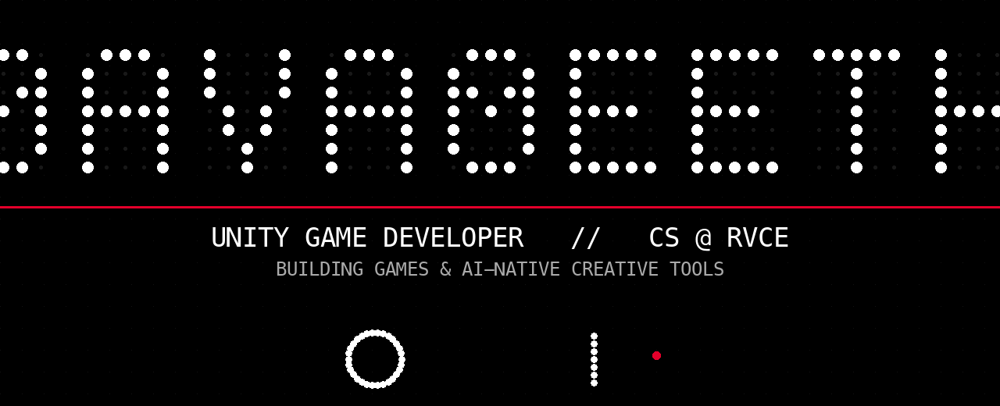

---

**Unity Game Developer** · *CS Student, RV College of Engineering (B.E. expected 2027)*

*I build and ship mobile games & apps, and AI-native creative tooling — with a focus on polished, performant, user-centric experiences.*

---

### 🛠️ Tech Stack

| | |
|---|---|
| **Languages** | C# · C · C++ · TypeScript · Rust · Python · Dart · Java · Swift |
| **Game / 3D** | Unity (2D/3D) · HDRP · URP · ShaderLab · WebGL · Physics |
| **Frameworks** | React · Electron · Flutter · FastAPI · Next.js · Vite |
| **AI/ML** | Whisper · LLM Systems · TF-IDF · scikit-learn |
| **Backend / Cloud** | Firebase (Auth · RTDB · Storage) · AWS · Supabase · REST |
| **Mobile** | Android (Unity) · Google Play Console · AdMob |
| **Tools** | Git · FFmpeg · wgpu · pnpm · Tableau · Figma |

---

### 🔨 Featured Projects

> All public repositories — no private repos linked.

<table>
<tr>
<td width="50%">

**📱 [RVCE SIP](https://github.com/MadeNavaneeth/RVCE-SIP)** — *Published Jan 2024*
Academic management app in Unity. Clean UI, shipped to Google Play — **450+ installs**.

</td>
<td width="50%">

**🎬 [Palmier Pro](https://github.com/MadeNavaneeth/palmier-pro-windows)** — ⭐ 2
AI-native video editor: Electron + React + Rust/wgpu + FFmpeg + MCP.
*TypeScript · Rust*

</td>
</tr>
<tr>
<td>

**🎮 [Helix-Jump-Game](https://github.com/MadeNavaneeth/Helix-Jump-Game)** — *July 2025*
Procedural physics-based mobile game (Unity). Platform generation, scoring, optimized game loop & controls.

</td>
<td>

**🧩 [Mineogram](https://madenavaneeth.itch.io/)** — *Apr 2026 · Itch.io*
Minesweeper + Nonogram logic puzzle with deterministic, deduction-based levels. **#1 "Enjoyable Difficulty" & #2 "Fun" — Reimagining Minesweeper Jam.**

</td>
</tr>
<tr>
<td>

**🏃 [9 Lives Runner](https://madenavaneeth.itch.io/)** — *Oct 2025 · Itch.io*
Endless runner with dimension-switching mechanics + custom health/scoring. **Ranked 6th — Make Your Game Jam (MIT).**

</td>
<td>

**📊 [PlayerPulseAnalytics](https://github.com/MadeNavaneeth/PlayerPulseAnalytics)**
Real-time game analytics dashboard: ML-powered churn prediction, live-ops feeds, Tableau Extension.

</td>
</tr>
<tr>
<td>

**🅰️ [AR_Assignment](https://github.com/MadeNavaneeth/AR_Assignment)**
AR app (Unity + AR Foundation, ARKit/ARCore) detecting vertical planes and overlaying transparent video.

</td>
<td>

**☁️ [Unity-AWS-Toolkit](https://github.com/MadeNavaneeth/Unity-AWS-Toolkit)**
AWS for every Unity platform, including WebGL. Pure C# REST toolkit.

</td>
</tr>
<tr>
<td>

**🔥 [Unity-Firebase-Toolkit](https://github.com/MadeNavaneeth/Unity-Firebase-Toolkit)**
Firebase for every Unity platform, including WebGL. Pure C# REST toolkit.

</td>
<td>

**🧠 [LLM-Memory-System](https://github.com/MadeNavaneeth/LLM-Memory-System)**
Local-first LLM memory layer (Python).

</td>
</tr>
<tr>
<td>

**🧹 [datacleaning_openenv](https://github.com/MadeNavaneeth/datacleaning_openenv)** — Python data-cleaning environment.

</td>
<td>

**🖥️ [Resource-Monitoring-and-Management-System](https://github.com/MadeNavaneeth/Resource-Monitoring-and-Management-System)** — Python resource monitoring & management.

</td>
</tr>
</table>

---

### 💼 Experience

<table>
<tr>
<td width="50%">

**Game Developer Intern** — *eternoplay Studios Pvt. Ltd*
📅 Jul 28 – Sep 30 2025 · Remote

- Live production game **HexaBattle** on Google Play
- **AdMob** monetization, UI systems, audio manager, leaderboards
- Shipped updates & fixed issues for active users
- Maintained performance & gameplay quality

</td>
<td width="50%">

**Trainee Video Game Programmer** — *Karma Play Academy (UK)*
📅 Mar 10 – Jul 10 2025 · Remote

- **Hollywood Director: The Simulation** — simulation game system
- **HDRP post-processing** (Beautify), scene/global volume configs
- Settings system: resolution + refresh-rate, **ultrawide** support
- Camera systems, themed UI, real-time rendering, PlayerPrefs persistence

</td>
</tr>
</table>

---

### 🌍 Open Source

Verified PRs across major projects:

<table>
<tr>
<td>

**[Remotion](https://github.com/remotion-dev/remotion)** — ⭐ 24k+ · Programmatic video (TS/React)
- `#10863` Studio: alphabetical sort toggle for compositions
- `#10862` Studio: expand effects panel when adding an effect
- `#10860` Studio: open number input when tabbing an InputDragger
- `#10837` Fix caption elements not movable/hideable in Studio

</td>
<td>

**[Excalidraw](https://github.com/excalidraw/excalidraw)** — ⭐ 95k+ · Whiteboard (TS)
- `#11964` Switch arrow types of bound arrows via shape switcher
- `#11969` Resolve Dialog `aria-labelledby` to namespaced title id
- `#11968` Detect localStorage quota errors in non-Chromium browsers

</td>
</tr>
<tr>
<td>

**[uutils/coreutils](https://github.com/uutils/coreutils)** — ⭐ 20k+ · Rust GNU coreutils
- `#14144` *(merged)* `sort`: attached `-t=` field separator
- `#14145` `sort`: GNU blank set (space/tab) for `-d`/`-n`
- `#14148` `paste`/`join`: attached `-d=`/`-t=` separators
- `#14158` `sort`: clustered short options ending in `-t`

</td>
<td>

**[lossless-cut](https://github.com/mifi/lossless-cut)** — ⭐ 25k+ · Lossless editing
- `#3032` Fix inflated output duration on `attached_pic` streams

</td>
</tr>
</table>

---

### 🏆 Achievements

🥇 **1st — Firebase App Jam** (Kalpavikas Tech Fest, RV University)
🥈 **Runners-up — Exuberance 2025** (E-Cell, RVCE)
🥉 **6th — Make Your Game Jam** (MIT) · *9 Lives Runner*
🏅 **#1 "Enjoyable Difficulty" & #2 "Fun"** — Reimagining Minesweeper Jam · *Mineogram*

---

### 🎓 Certifications

**Game Design and Development 1: 2D Shooter** — Coursera, Michigan State University

---

### 🌟 Extracurricular

**Senior Executive** — RVCE ACM Student Chapter (Dec 2024–) · events & workshops
**Design Team Lead** — IEEE RVCE (Feb 2025–) · event visuals & assets
**Member** — Coding Club RVCE (Dec 2024–) · coding & collaborations

---

**Yadamreddy Navaneeth** · 📞 +91 9908412469 · ✉️ nthy2355@gmail.com

[GitHub](https://github.com/MadeNavaneeth) · [LinkedIn](https://linkedin.com/in/navaneeth-yadamreddy) · [Itch.io](https://madenavaneeth.itch.io/)

*"The best tools get out of the way and let you create."*

